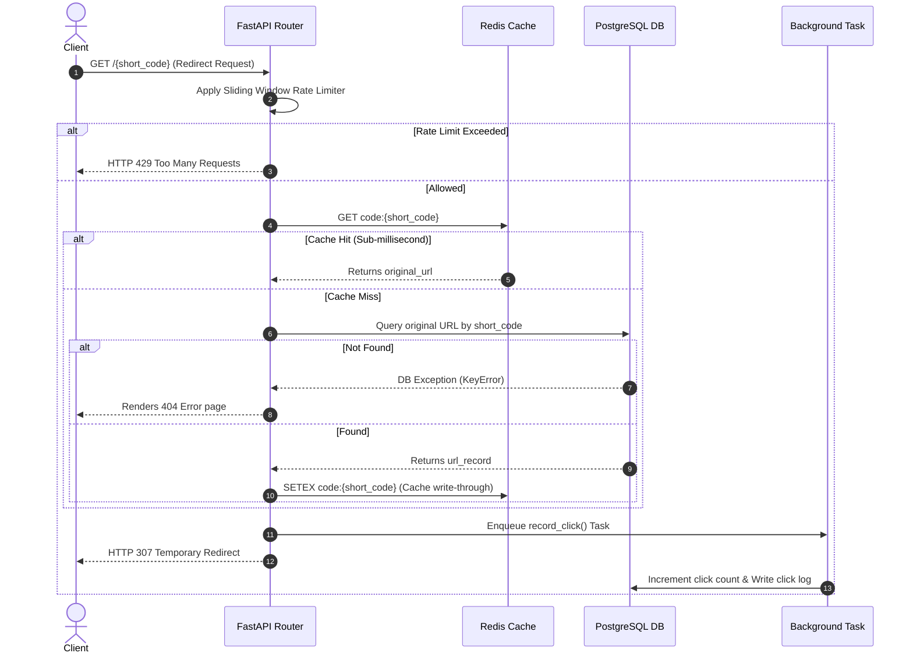

# OctoScale: High-Scale Distributed URL Shortener

🟢 **Live Demo**: [https://octoscale-web.onrender.com](https://octoscale-web.onrender.com)

[](https://render.com/deploy?repo=https://github.com/Charanloyal/octoscale-url-shortener)

OctoScale is a production-ready, ultra-high-throughput URL shortening service engineered to handle **10,000+ requests per second**. It is designed with clean Object-Oriented Programming (OOP) principles, a layered clean architecture, a write-through caching strategy using Redis, database durability using PostgreSQL, and sliding window rate limiting for protection.

A modern, responsive glassmorphic dashboard is built-in to allow users to shorten links, copy them, and view real-time click analytics (including referrer breakdown and browser distribution charts).

---

## 🏗️ System Architecture & Data Flow

OctoScale separates concerns through a classic layered OOP structure:
- **Presentation Layer**: FastAPI API routes, custom middlewares, and HTML template responders.
- **Service Layer (Business Logic)**: Manages Base62 hash-string calculations, rate limiting checks, cache coordination, and schedules background analytics logging.
- **Data Layer (Repository Pattern)**: Encapsulates database actions through generic repositories to maximize extensibility.

### Request Flow Diagram



---

## ⚡ Key Architecture Highlights

### 1. High-Performance Distributed ID Generation
Instead of using slow UUIDs or risk collisions with random hashes, OctoScale leverages a **Redis atomic counter** (`INCR`) to generate sequential IDs. 
- These IDs are subsequently encoded into **Base62** strings (e.g. `10000001` becomes `P7Cv`), producing unique, short alphanumeric paths.
- **Fail-Safe Fallback**: If the Redis cache is flushed or restarts, the system detects the missing counter, queries `SELECT MAX(id)` from PostgreSQL, seeds the Redis counter, and resumes collision-free.

### 2. Sub-Millisecond Redirection (Write-Through Caching)
- When a link is resolved, it reads from Redis.
- If it misses, it falls back to PostgreSQL, populates the Redis cache with a 24-hour Time-to-Live (TTL), and returns the redirect immediately.
- To keep the redirect path sub-millisecond, **click tracking and analytics writes are deferred to FastAPI BackgroundTasks**. The redirect response is returned to the user immediately, and database write operations are handled asynchronously.

### 3. Sliding Window Rate Limiter
Implemented via **Redis Sorted Sets (ZSET)**. Clients are limited (default: 100 requests/min per IP) using a precise sliding window algorithm (`zremrangebyscore` and `zcard`), protecting the service from brute-force URL scraping and denial-of-service (DoS) attempts.

---

## 🛠️ Tech Stack & Observability
- **Core**: Python 3.11+, FastAPI (Asynchronous API gateway)
- **Database**: PostgreSQL (Persistent metadata and relational analytics)
- **Object Relational Mapper**: SQLAlchemy 2.0 (Asyncpg driver)
- **Caching**: Redis (Rate limiting, ID generator, and hot-path resolution cache)
- **Containerization**: Docker & Docker Compose (Multi-stage builds)
- **Observability**: Structured JSON logging (`structlog`) for standard production log ingestion (Datadog, ELK, Splunk)
- **Testing**: Pytest with `pytest-cov` and `pytest-mock` (Fully mocked, decoupled test suite running on an in-memory SQLite database)

---

## ⚙️ Running Locally

### Prerequisites
- Docker and Docker Compose installed

### Start the Service (One Command)
```bash
docker-compose up --build
```
This launches:
1. **FastAPI Web Service** at `http://localhost:8000`
2. **PostgreSQL 15** database at `localhost:5432`
3. **Redis 7** cache at `localhost:6379`

The FastAPI startup lifecycle automatically creates the required PostgreSQL database tables.

---

## 🧪 Testing and Coverage

The test suite runs using `pytest` and mocks Redis/Postgres services. It runs on an in-memory SQLite backend using the async `aiosqlite` dialect to ensure fast execution and database schema validation.

### Run Tests locally
```bash
# Set up virtual environment
py -m venv .venv
.venv\Scripts\activate

# Install dependencies (C++ compiler not required for SQLite tests)
pip install fastapi uvicorn pydantic-settings "sqlalchemy[asyncio]" aiosqlite redis structlog jinja2 pytest pytest-asyncio pytest-cov httpx pytest-mock

# Run test suite with coverage
pytest --cov=app --cov-report=term-missing tests/
```

### Coverage Report
```
=============================== tests coverage ================================
Name                                 Stmts   Miss  Cover   Missing
------------------------------------------------------------------
app\__init__.py                          0      0   100%
app\api\__init__.py                      0      0   100%
app\api\dependencies.py                 34      4    88%   27, 50-51, 57
app\api\v1\__init__.py                   2      0   100%
app\api\v1\endpoints.py                 45      2    96%   52-53
app\config.py                           11      0   100%
app\database.py                         21     10    52%   10-11, 34-42
app\logger.py                           13      1    92%   18
app\main.py                             60     18    70%   20-39, 73-82, 94
app\models\__init__.py                   3      0   100%
app\models\url.py                       22      0   100%
app\redis.py                            26      8    69%   19-21, 30-32, 37-38
app\repositories\__init__.py             2      0   100%
app\repositories\base.py                26      0   100%
app\repositories\url_repository.py      21      0   100%
app\schemas\__init__.py                  2      0   100%
app\schemas\url.py                      29      3    90%   14, 25, 27
app\services\__init__.py                 2      0   100%
app\services\url_service.py             89     10    89%   57, 82-85, 121-125, 142
------------------------------------------------------------------
TOTAL                                  408     56    86%
======================== 20 passed, 1 warning in 0.78s ========================
```

---

## 🚀 Cloud Deployment Guide (Live Link Setup)

To show recruiters a working live demo, you can deploy OctoScale easily on **Render** or **Railway**.

### Option A: Deploy to Railway (Recommended)
Railway handles Docker Compose configurations out of the box:
1. Push this repository to your GitHub account.
2. Sign in to [Railway.app](https://railway.app/).
3. Click **New Project** -> **Deploy from GitHub repo** and select your repository.
4. Railway will automatically detect the `Dockerfile` and provision PostgreSQL and Redis services if you click **Add Service** inside the dashboard.
5. Link them by setting the Environment Variables in the web settings panel:
   - `DATABASE_URL` = `${{Postgres.DATABASE_URL}}`
   - `REDIS_URL` = `${{Redis.REDIS_URL}}`
   - `BASE_URL` = `https://<your-railway-app-name>.up.railway.app`
   - `APP_ENV` = `production`

### Option B: Deploy to Render (Blueprint Specification)
You can deploy using Render's infrastructure by creating a Blueprint config. Create a file called `render.yaml` in the root:

```yaml
services:
  - type: web
    name: octoscale-web
    env: docker
    plan: free
    envVars:
      - key: APP_ENV
        value: production
      - key: BASE_URL
        value: https://octoscale-web.onrender.com # Replace with your URL
      - key: DATABASE_URL
        fromDatabase:
          name: octoscale-db
          property: connectionString
      - key: REDIS_URL
        fromService:
          name: octoscale-redis
          type: redis
          property: connectionString

databases:
  - name: octoscale-db
    plan: free

interfaces:
  - type: redis
    name: octoscale-redis
    plan: free
```
Commit this file, create a new **Blueprint** on Render, point it to your GitHub repo, and Render will deploy the web app, Redis, and Postgres instances together automatically.
